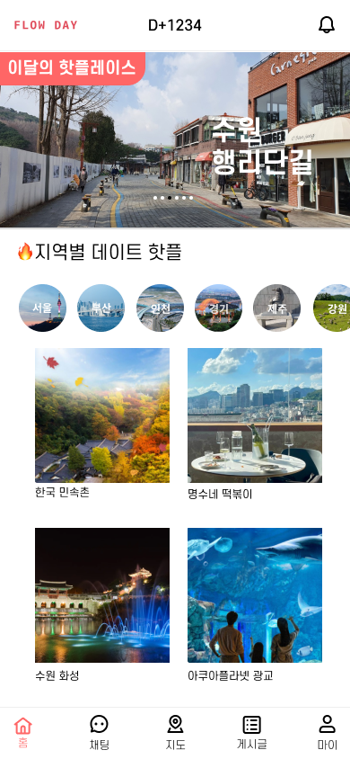
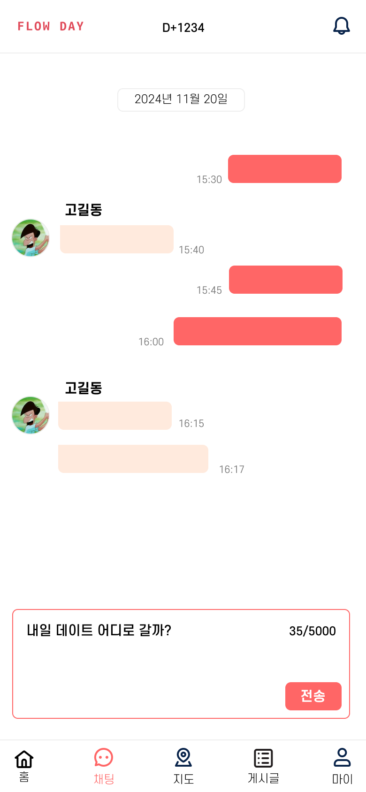
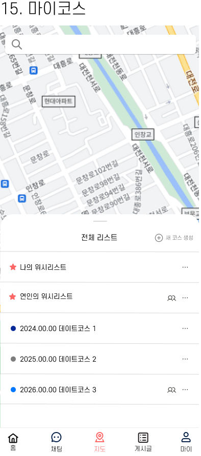
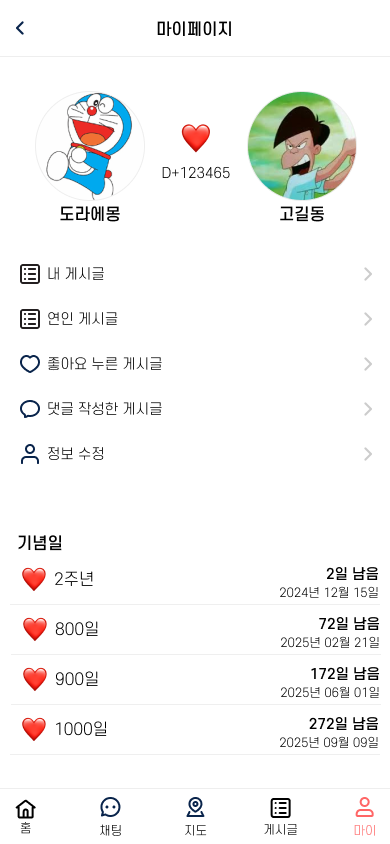
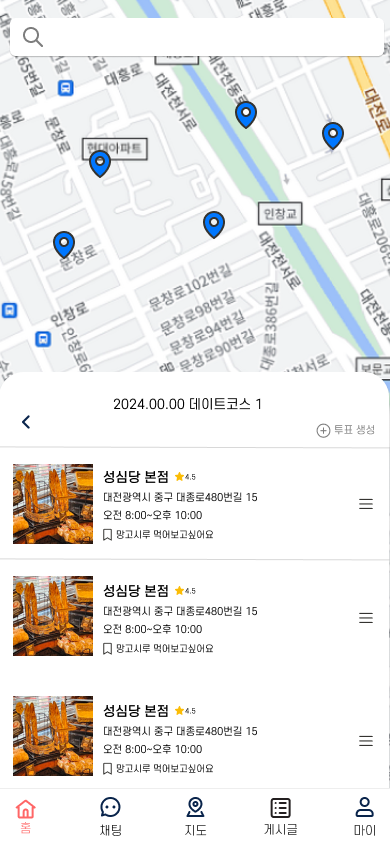

# FlowDay (플로우데이)

## 📱 프로젝트 소개

플로우 데이는 연인과 데이트 코스를 공유하는 앱입니다.

    
    
    
    
    
    
    

## 🛠 주요 기능

### 1. 이달의 핫플레이스 추천

### 2. 지역별 데이트 핫플 추천

### 3. 커플 간 채팅 기능

### 4. 연인과 함께 데이트 코스 선정 & 공유 기능

### 5. 코스를 포스팅하여 공유 기능

## 👥 팀원 소개

### Frontend

|  |  |  |
| :----------------------------------------------------------------------------------------: | :----------------------------------------------------------------------------------------: | :----------------------------------------------------------------------------------------: |
|                                           임재현                                           |                                           이의영                                           |                                           김혜준                                           |
|                      [JaeHyun10-03](https://github.com/JaeHyun10-03)                       |                         [snsdl0905](https://github.com/snsdl0905)                          |                         [hyejun-fe](https://github.com/hyejun-fe)                          |

### Backend

|  |  |  |  |  |
| :---------------------------------------------------------------------------------------: | :----------------------------------------------------------------------------------------: | :---------------------------------------------------------------------------------------: | :----------------------------------------------------------------------------------------: | :----------------------------------------------------------------------------------------: |
|                                          서상원                                           |                                           강예진                                           |                                          황유정                                           |                                           임재영                                           |                                           천영상                                           |
|                        [seosangwon](https://github.com/seosangwon)                        |                       [kang-ye-jin](https://github.com/kang-ye-jin)                        |                      [youjungHwang](https://github.com/youjungHwang)                      |                            [asklas](https://github.com/asklas)                             |                     [CHUNYOUNGSANG](https://github.com/CHUNYOUNGSANG)                      |

## 🔧 기술 스택

### Frontend

### Backend

